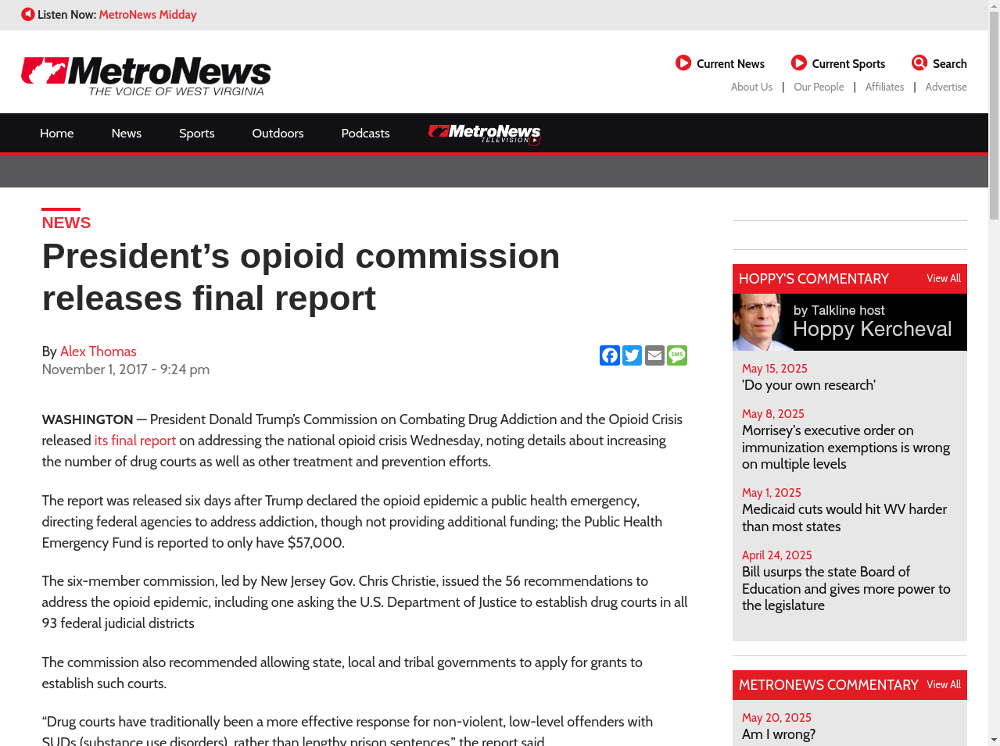

# Opioid Crisis Data Analysis Project



## Project Overview

This repository contains the data analysis work performed for the Commission on Combating Drug Addiction and the Opioid Crisis. The project focused on analyzing Virginia's opioid crisis data and providing critical insights that informed resource allocation decisions at the community level.

## Project Description

As part of the data team supporting the Commission on Combating Drug Addiction and the Opioid Crisis, I developed and maintained data analysis workflows that provided weekly updates on large datasets containing key metrics related to Virginia's opioid crisis. The analysis revealed rapid increases in opioid-related deaths, which directly impacted resource allocation decisions for Narcan distribution at the community zip code level.

The project utilized R for geocode mapping and Tableau for visualization, creating a powerful data-driven approach to combating the opioid epidemic in Virginia communities.

## Features

- **Weekly Data Updates**: Regular analysis of large datasets tracking opioid-related metrics
- **Geocode Mapping**: Zip code level analysis for targeted resource allocation
- **Resource Optimization**: Data-driven Narcan distribution based on need
- **Trend Analysis**: Tracking and forecasting of opioid-related deaths and incidents
- **Interactive Visualizations**: Tableau dashboards for stakeholder decision support

## Technologies Used

- **R**: Statistical analysis and geocode mapping
- **Tableau**: Data visualization and interactive dashboards
- **SQL**: Data extraction and transformation
- **ETL Processes**: Data preparation and integration workflows
- **Geospatial Analysis**: Zip code level mapping and hotspot identification

## Data Analysis Methodology

The project employed a comprehensive data analysis approach:

1. **Data Collection**: Integration of multiple data sources including healthcare, law enforcement, and emergency services
2. **Data Cleaning**: Standardization and validation of datasets from disparate sources
3. **Statistical Analysis**: Identification of trends, patterns, and correlations
4. **Geospatial Mapping**: Visualization of data at the zip code level
5. **Resource Allocation Modeling**: Optimization algorithms for Narcan distribution
6. **Impact Assessment**: Tracking effectiveness of interventions over time

## Key Metrics Analyzed

- Opioid-related deaths by location and demographic
- Emergency department visits for overdoses
- Narcan administration events
- Prescription patterns and rates
- Treatment facility utilization
- Recovery program outcomes

## Impact

This data analysis work directly contributed to:

- **Targeted Resource Allocation**: Ensuring Narcan was available where most needed
- **Policy Development**: Informing evidence-based policy decisions
- **Public Health Response**: Enabling rapid response to emerging hotspots
- **Community Awareness**: Supporting educational initiatives in high-risk areas
- **Lives Saved**: Ultimately contributing to overdose prevention efforts

## References

- President's Commission on Combating Drug Addiction and the Opioid Crisis: [Final Report](https://wvmetronews.com/2017/11/01/presidents-opioid-commission-releases-final-report/)
- Virginia Department of Health Opioid Data: [VDH Opioid Dashboard](https://www.vdh.virginia.gov/)

## Project Structure

```
├── data_processing/
│   ├── r_scripts/
│   ├── data_cleaning/
│   └── geocoding/
├── analysis/
│   ├── statistical_models/
│   ├── trend_analysis/
│   └── resource_allocation/
├── tableau_workbooks/
│   ├── public_dashboards/
│   └── internal_analytics/
└── documentation/
    ├── methodology/
    └── findings/
```

## Key Findings

- Identified specific zip codes with disproportionately high opioid-related incidents
- Discovered correlations between prescription patterns and overdose rates
- Mapped the spread of synthetic opioids across communities
- Quantified the impact of Narcan availability on overdose outcomes
- Tracked effectiveness of community intervention programs

## Future Directions

- Integration with predictive modeling for early warning systems
- Expanded demographic analysis for targeted interventions
- Cross-state data sharing and comparative analysis
- Long-term recovery outcome tracking
- Economic impact assessment of intervention strategies

---

*This project demonstrates expertise in data analysis, geospatial mapping, public health analytics, and resource optimization for critical healthcare challenges.*
